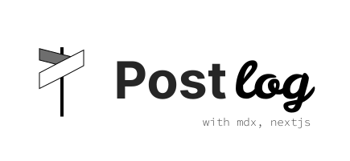

github blog solution with [next.js](https://nextjs.org/), which supports [mdx](https://mdxjs.com/)

## Preparing to support solution for everyone via cli feature.

    
Project reorganization plan written in Korean

    
## 프로젝트 개편 예정

`Next.js` 기능들을 사용해보기 위해 시작한 프로젝트 였으나, 프로젝트로써의 기능성이 부족한 토이프로젝트 였습니다.

중간중간 레이아웃도 수정해보고 했지만 무언가 근본적인 개편이 필요하다 생각이 들었습니다.

무엇보다 토이프로젝트로 끝내기엔 너무 아쉬움이 들어 새롭게 개편해보려고 합니다.

## Next 14 업데이트

`Nextjs` 가 14로 업데이트 됐습니다. 이제 설정 파일에서 `output` 속성을 `export` 로 설정해두고 데브 서버를 사용할 수가 없게 됐습니다. (현재로썬 그렇습니다.)

그래서  14 버전에 맞게 새로 개발 서버와 실제 빌드 과정을 분리를 엄격하게 해볼 예정입니다.

또한 쓸데없이 `.env` 파일을 참조하고 있어 불편한 문제도 있었습니다.

## 문서 프로젝트 분리

문서를 `public/docs` 디렉토리 내에 배치 되어 있어 해당 디렉토리 내에서 수정하는 것이 불편했습니다.

따라서 문서 부분을 따로 깃 레포지토리 화 하여 따로 관리될 수 있도록 하려고 합니다.

또한 마크다운보다 더 넓은 기능을 제공하는 `mdx`를 사용할 생각입니다.

## 라우팅 방식 개편

파일명을 정할 때 매번 라우팅을 위한 슬러그 이름을 어떻게 설정해야할지 고민했습니다. 처음에는 `idx`, 즉 넥스트에서 빌드시 글을 먼저 읽는 순서에 따라 파싱을 하도록 했습니다.

그렇게하면 문제점이 생깁니다. 글의 순서가 조금이라도 바뀌거나 중간에 글을 읽는 순서를 조금이라도 바꾸게 된다면, 라우팅의 링크의 무결성이 깨지기 때문입니다. 
이때 제가 정의하는 라우터의 무결성이란, 특정 페이지를 가르키는 링크는 일정해야하는 저만의 원칙입니다.

예상치 못하는 상황에서 같은 링크가 다른 내용을 표시하면 혼란을 줄 것이 명백하기 때문입니다.

따로 링크에 표시되는 내용을 제가 정의해보자 했습니다. `slug` 항목을 따로 두어 현재 프로젝트의 경우는 파일명이 슬러그 항목입니다. 정해보자라고 생각했지만,

따라서 인덱스를 `front-matter` 에 자동으로 할당하는 코드를 짜볼 계획 입니다. 직접 `Nodejs` 로 문서를 수정해야할 것 같습니다.

## 블로그 서버 형상관리 문제 & 문서 업로드 시 자동화

현재 프로젝트에서 `docs` 폴더가 현재 블로그 부분을 맡고 있습니다.

그런데, 개발 모드 (`dev`) 이용 시 해당 폴더가 개발용 서버로 바뀝니다. 이로 인해 깃 형상 관리 시 해당 부분이 강제로 수정되어 어떤 파일이 바뀌었는지 추적하는데 불편함을 많이 겪었습니다.

따라서 아예 빌드 결과물을 `gh-pages` 브랜치에 업로드할 생각입니다.

그런데 빌드 결과물을 다른 브랜치로 옮기는 일이 쉽지 않아 보였습니다. 따라서 이를 `Github Action` 을 이용하여 자동화할 계획입니다.

제킬 블로그를 좀 더 깊게 참고해보았는데, 깃허브 액션에서 `next build` 도 지원을 하고 있었습니다.

따라서 문서 레포가 수정이 된다면, 블로그 레포를 이용하여 빌드 작업을 자동으로 수행한 후 블로그의 `gh-pages` 브랜치에 업데이트 할 수 있도록 자동화해볼 예정입니다.

## 코드 리팩토링

제 블로그 솔루션을 다른 개발자 분들도 쉽게 따라할 수 있게 하고 동시에 리액트의 여러 기능들을 확장할 수 있도록 읽기 쉽도록 코드를 짜볼 생각입니다.

커스텀 훅을 적극적으로 활용해보면 좋지 않을까 생각하지만, 이 부분에 대해선 아직 고민이 많이 되고 있습니다.

## Commit Message Convention 엄격히 사용

현재 2인으로 진행중인 프론트엔드 프로젝트 (가제 `Graph2Code`) 를 개발하며 협업과 올바른 형상 관리를 위해서는
엄밀한 커밋 기록 관리도 필요해보였고, 실제로 소통하는데 도움이 많이 되었습니다. 현재까지 기준으로 총 7회 구두 회의를 진행하였는데, 현재는 월에 2회 정도로 많이 줄었습니다.

협업에 있어서 중요하지만, 과거 제가 어떤 코드를 짰는지 리뷰를 진행할 때에도 중요하다고 생각이 들었습니다. 그래서 `Commit Message Convention` 을 제대로 지켜볼 생각입니다.

브랜치도 마찬가지입니다. `develop` 브랜치와 `master` 브랜치를 사용하여 본 프로젝트를 다른 유저가 사용할 때 예기치못한 버그가 없도록 하려고 합니다.

